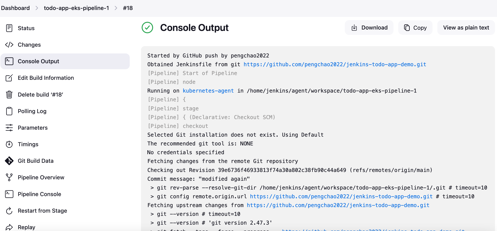

# Jenkins-CD-todo-App-Demo

In this demo, I use the github repo to store the code and use jenkins to deliver to AWS EKS,

with python flask and mysql database connected, mysql also running in EKS pod with a ClusterIP service

using alb for web accessing. having set the webhook in github and configured the credential in jenkins,

when a push event in github, the jenkins will build the app automatically

## Features

- mysql pod for the database 

- flask for the HTTP request and Database connection and CRUD

- alb for the web access with internet

- github for the CI and jenkins for the CD

## Usage

- you have alb-ingress-controller and ebs csi controller installed in your EKS cluster

- your jenkins already configure the aws-credentials

- here's the pods running in EKS

here's the website looks like:

- here's the Jenkins pipeline stage looks like

- here's the Jenkins console outputs looks like

